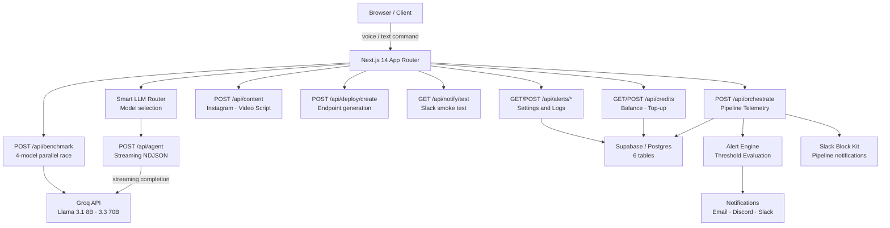
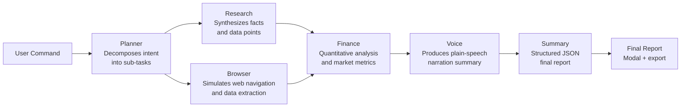

# Neural OPS

**AI Agent Orchestration Platform — Built for India**

Neural OPS is a production-grade command center for running multi-agent AI pipelines. Submit a natural language command and watch a coordinated fleet of specialized agents plan, research, browse, analyze, narrate, and summarize in real time — with live streaming output, an animated workflow graph, a smart LLM router that picks the cheapest model for your task, voice I/O in 10 Indian languages, one-click deployment as an API endpoint or WhatsApp bot, and a full credits & billing system priced in ₹.

---

## Table of Contents

1. [Overview](#overview)
2. [Architecture](#architecture)
3. [Agent Pipeline](#agent-pipeline)
4. [Smart LLM Router](#smart-llm-router)
5. [Voice Command & Output](#voice-command--output)
6. [Tools & Connections](#tools--connections)
7. [Deploy Feature](#deploy-feature)
8. [Credits & Billing](#credits--billing)
9. [Model Benchmark](#model-benchmark)
10. [Content Export](#content-export)
11. [Alert System](#alert-system)
12. [Slack Notifications](#slack-notifications)
13. [Tech Stack](#tech-stack)
14. [Database Schema](#database-schema)
15. [Getting Started](#getting-started)
16. [Environment Variables](#environment-variables)
17. [Keyboard Shortcuts](#keyboard-shortcuts)
18. [Project Structure](#project-structure)
19. [Deployment](#deployment)

---

## Overview

Neural OPS exposes a single command interface. The user types a query — e.g. *"Research NVIDIA stock and summarize the latest AI news"* — and six agents execute in a directed pipeline. Each agent streams its output token by token. When the pipeline finishes, a structured final report is generated and optionally narrated aloud.

### What makes it India-first

- All pricing in **₹** (Indian Rupees) — no dollar billing
- **Sarvam AI** models (30B and 105B) natively supported, 23× cheaper than Claude Sonnet for Indian-language tasks
- **10 Indian languages** for voice input and output (Hindi, Tamil, Telugu, Bengali, Marathi, Gujarati, Kannada, Malayalam, Punjabi, English)
- Integrations with **Razorpay, WhatsApp Business, Google Workspace** and other India Stack tools
- **UPI / Card / Net Banking** top-up for credits

---

## Architecture



---

## Agent Pipeline

Six agents execute in a fixed topology. Planner always runs first. Research and Browser execute in parallel. Finance, Voice, and Summary run sequentially after.



Each agent receives the accumulated context from all previous agents, allowing downstream agents to build on upstream findings.

| Agent | Role | Input |
|---|---|---|
| Planner | Decomposes query into 3–4 numbered steps | Query only |
| Research | Synthesizes factual information and key data points | Query + planner output |
| Browser | Simulates URL navigation and data extraction | Query + prior context |
| Finance | Provides quantitative analysis and market metrics | Full context |
| Voice | Writes a concise plain-text narration (no markdown) | Full context |
| Summary | Produces a JSON object: title, keyFindings, recommendation, confidence | Full context |

**Failure handling:** every agent retries once on error. If the retry also fails the agent is marked failed, a fallback message is stored, and the pipeline continues.

---

## Smart LLM Router

Before every pipeline run the router analyses the command and automatically selects the most cost-efficient model. The selected model and estimated cost are shown in the **RouterBadge** below the command input. Users can override the choice manually.

### Supported models

| Model | Provider | ₹ / 1K tokens | Best for |
|---|---|---|---|
| Sarvam-30B | sarvam.ai | ₹0.04 | Indian languages — simple tasks |
| Sarvam-105B | sarvam.ai | ₹0.08 | Indian languages — complex tasks |
| Claude Haiku | Anthropic | ₹0.21 | Fast, cost-efficient English tasks |
| Claude Sonnet | Anthropic | ₹0.94 | Research and multi-step analysis |
| Claude Opus | Anthropic | ₹4.69 | Complex reasoning and long documents |
| smallest.ai TTS | smallest.ai | ₹0.12 | Voice synthesis |
| Gnani Vachana | Gnani.ai | ₹0.10 | Indian language voice synthesis |

### Routing logic

1. Detects **Indian language** via Unicode script ranges and transliteration patterns
2. Scores task **complexity** (simple / medium / complex) from keywords and word count
3. Detects **voice output** intent
4. Selects the cheapest model that meets the task requirements
5. Displays **savings vs Claude Sonnet** baseline in the RouterBadge

---

## Voice Command & Output

### Voice input

A microphone button sits inside the command input bar. Clicking it starts recording via the Web Speech API.

- **Language selector** with 10 Indian languages: Hindi, Tamil, Telugu, Bengali, Marathi, Gujarati, Kannada, Malayalam, Punjabi, English
- **3-second silence timer** auto-stops the recording
- **Animated waveform** rendered with `requestAnimationFrame` while recording
- Transcribed text is inserted directly into the command input
- Graceful error message shown on unsupported browsers

### Voice output

After the pipeline completes, a **speaker button** appears in the topbar next to the PIPELINE COMPLETE badge. Clicking it reads the Voice agent's output aloud using the Web Speech API in the language selected for input. A CSS-animated waveform plays during narration.

---

## Tools & Connections

`/connections` lets users connect external tools that are then automatically injected as context into every subsequent agent prompt.

### Featured India Stack integrations

| Tool | Auth method |
|---|---|
| Razorpay | API key |
| WhatsApp Business | OAuth |
| Google Workspace | OAuth |
| Notion | OAuth |
| Slack | OAuth |
| GitHub | OAuth |

### Composio tool grid

~24 additional tools across 6 categories (Productivity, CRM, Finance, Dev, Analytics, Communication) searchable by name or category.

### How context injection works

After a tool is connected, `lib/composio.ts` builds a tool-context string prepended to the system prompt of every agent call via `/api/agent`. Example:

```
[Connected Tools]
- Razorpay: Access to payment analytics and transaction history
- GitHub: Access to repository data and code context
```

Connected tools are persisted to `localStorage` (`nos_connections`) and synced to the `user_connections` Supabase table fire-and-forget.

---

## Deploy Feature

After any pipeline completes, a **Deploy this pipeline** button appears. It opens a modal with two deployment paths.

### API Endpoint

Generates a unique `endpointId` and `apiKey`. The pipeline is exposed at:

```
POST https://api.neural-ops.com/run/{endpointId}
Authorization: Bearer nor_live_...
```

### WhatsApp Bot

Enter a phone number, receive a deterministic SVG QR code (generated client-side via a `hash32()` function — no external dependency). Scanning the QR links the number to the pipeline.

### Deployments page

`/deployments` lists all active deployments with:
- Type badge (API / WhatsApp)
- Status pill (Active / Paused)
- Sparkline (deterministic, derived from `endpointId`)
- Calls today counter
- Pause / Resume toggle
- Reveal / hide API key
- Copy URL and API key buttons
- Delete with confirmation

Deployments are stored in `localStorage` (`nos_deployments`) and synced to the `deployments` Supabase table.

---

## Credits & Billing

`/credits` is a full billing dashboard priced in Indian Rupees.

### Balance card

- Live ₹ balance with a progress bar (relative to ₹500 soft limit)
- Topbar chip shows current balance and updates after every run
- Sonner toast fires after each run: `"Run cost ₹0.18. Balance: ₹48.02"`

### Usage stats

4 stat cards: Total Tokens · Total Spent · Total Saved vs Claude Sonnet · Top Model Used

### 7-day savings chart

Recharts `BarChart` showing daily savings (₹) vs Claude Sonnet baseline for the past week.

### Usage history table

Paginated (10 per page), shows: date, command preview, model, tokens, cost, savings.
**Export as CSV** downloads the full history.

### Top-up modal

| Method | Options |
|---|---|
| UPI | GPay, PhonePe, Paytm |
| Card | Visa / Mastercard / Rupay |
| Net Banking | All major Indian banks |

Preset amounts: ₹99 / ₹299 / ₹499 / ₹999 — plus a custom amount field.
Payment is mocked (1.2s delay → credits added). Real Razorpay integration can be wired to the existing `addCredits()` helper in `lib/credits.ts`.

### Storage

Credits balance is stored in `localStorage` (`nos_credits`) as the primary source of truth. Every run writes a record to `nos_run_history` and optionally to the `credits_transactions` Supabase table via `/api/credits`.

---

## Model Benchmark

`/benchmark` — "Find your perfect AI model."

Type any task. All four models run in parallel and stream their responses side by side. After all four complete, a Groq judge call scores each response 1–10 and picks a winner.

### How it works

1. `POST /api/benchmark` runs 4 models concurrently via `Promise.all`
2. Each model emits `start → token → model_done` events over an NDJSON stream
3. Sarvam-30B and Sarvam-105B use task-aware mock responses (no Sarvam API key needed)
4. Claude Haiku maps to `llama-3.1-8b-instant` via Groq
5. Claude Sonnet maps to `llama-3.3-70b-versatile` via Groq
6. After all 4 finish, a judge prompt scores quality and picks the best model
7. A **Recommendation Banner** shows the winner, reason, and cost savings multiplier vs Claude Sonnet
8. **"Set as default for Hindi tasks"** saves the preference to `localStorage`

### Benchmark history

Last 5 benchmarks stored in `localStorage` (`nos_benchmark_history`). The history section shows the most-efficient model and its win percentage.

---

## Content Export

After every pipeline completes, a **"Turn into content"** bar appears with five export actions.

| Button | What it does |
|---|---|
| Export PDF | Generates a formatted PDF (jsPDF, dynamic import) with Neural OPS header, command, per-agent outputs, metrics, footer. Auto-downloads as `neural-ops-report-YYYY-MM-DD.pdf` |
| Export CSV | Downloads agent breakdown: Agent, Status, Tokens, Cost ₹, Output Preview, Duration. Auto-downloads as `neural-ops-agents-YYYY-MM-DD.csv` |
| Make Infographic | 3-step animated generation (Analyzing → Designing → Rendering). Shows a placeholder card with Download PNG / Copy. **Powered by DASHVERSE** (full API integration pending) |
| Instagram Post | Calls `/api/content` → Groq generates a 3-line caption + 10 hashtags + CTA. Shown inside a dark phone mockup with an Instagram-style post card. Individual copy buttons |
| Make Video Script | Calls `/api/content` → Groq generates a Hook (0–5s) + 3 timed main points (30s each) + CTA. Color-coded script sections with timestamps. Copy + Download .txt |

---

## Alert System

After every pipeline run, token usage is persisted and the alert engine evaluates three independent conditions against the user's configured thresholds.

| Type | Condition | Severity |
|---|---|---|
| Spike | Single run token count ≥ `spike_threshold` | Informational |
| Warning | Daily total between 80% and 100% of `daily_limit` | Warning |
| Critical | Daily total meets or exceeds `daily_limit` | Critical |

All three notification channels (Email, Discord, Slack) are independently toggleable from `/settings/alerts`.

---

## Slack Notifications

After every pipeline the orchestrate route fires a Slack **Block Kit** message to `SLACK_WEBHOOK_URL`.

### Message structure

- Header: "✅ Neural OPS — Pipeline Complete"
- 6-field grid: Command · Model · Total Tokens · Cost ₹ · Saved ₹ · Time Taken
- Summary text from the pipeline
- Per-agent token breakdown (Planner · Research · Browser · Finance · Voice)
- "View Dashboard" primary button linking to `NEXT_PUBLIC_APP_URL`

### Test the webhook

```
GET http://localhost:3000/api/notify/test
```

Returns `{"success":true}` if the webhook accepted the message.

The `notifyPipelineComplete()` function in `lib/notify.ts` is called fire-and-forget from `app/api/orchestrate/route.ts`. A missing `SLACK_WEBHOOK_URL` silently no-ops.

---

## Tech Stack

| Layer | Technology |
|---|---|
| Framework | Next.js 14 App Router, TypeScript |
| AI Models | Groq API — Llama 3.1 8B Instant, Llama 3.3 70B Versatile |
| Indian AI | Sarvam-30B, Sarvam-105B (mock — swap in live API key) |
| Styling | Tailwind CSS 3, custom design tokens |
| Animation | Framer Motion |
| Graph | ReactFlow with animated edges |
| Charts | Recharts (BarChart, ResponsiveContainer) |
| Voice | Web Speech API (recognition + synthesis) |
| PDF Export | jsPDF (dynamic import) |
| Auth | NextAuth v4 |
| Database | Supabase (Postgres) — 6 tables |
| Email | Resend |
| Notifications | Discord Webhooks, Slack Block Kit |
| Toasts | Sonner |
| Deployment | Vercel |

---

## Database Schema

Six tables, all protected by Row Level Security. Run `supabase/schema.sql` in the Supabase SQL Editor to create everything at once.

| Table | Purpose |
|---|---|
| `token_usage` | Per-run token counts and agent breakdown |
| `alert_settings` | User-configured thresholds and notification channels |
| `alert_logs` | History of every fired alert |
| `user_connections` | Connected tools (Razorpay, GitHub, Slack, etc.) |
| `deployments` | Deployed pipeline endpoints (API + WhatsApp) |
| `credits_transactions` | Credits ledger — add / deduct / topup rows |

---

## Getting Started

### 1. Clone and install

```bash
git clone https://github.com/pradhyum6144/Neural-OPS.git
cd Neural-OPS
npm install
```

### 2. Configure environment

```bash
cp .env.local.example .env.local
# Edit .env.local with your keys
```

The minimum required to run locally is `GROQ_API_KEY`, `NEXTAUTH_URL`, and `NEXTAUTH_SECRET`. Everything else is optional — the app falls back to `localStorage` when Supabase is not configured.

### 3. Create Supabase tables (optional)

Open your Supabase project → **SQL Editor** → paste `supabase/schema.sql` → **Run**.

### 4. Start the dev server

```bash
npm run dev
```

Open [http://localhost:3000/dashboard](http://localhost:3000/dashboard).

### 5. Test Slack notifications (optional)

```
GET http://localhost:3000/api/notify/test
```

---

## Environment Variables

| Variable | Required | Description |
|---|---|---|
| `GROQ_API_KEY` | **Yes** | Groq API key for all agent completions and benchmark |
| `NEXTAUTH_URL` | **Yes** | Full URL of your deployment e.g. `http://localhost:3000` |
| `NEXTAUTH_SECRET` | **Yes** | Random secret for NextAuth session encryption |
| `NEXT_PUBLIC_APP_URL` | **Yes** | Used in Slack "View Dashboard" button (same as NEXTAUTH_URL) |
| `NEXT_PUBLIC_SUPABASE_URL` | Optional | Supabase project URL — enables all server-side persistence |
| `SUPABASE_SERVICE_ROLE_KEY` | Optional | Supabase service role key — bypasses RLS for server writes |
| `SLACK_WEBHOOK_URL` | Optional | Slack Incoming Webhook URL — pipeline complete notifications |
| `RESEND_API_KEY` | Optional | Resend API key — enables email alerts |
| `GOOGLE_CLIENT_ID` | Optional | Google OAuth client ID |
| `GOOGLE_CLIENT_SECRET` | Optional | Google OAuth client secret |

---

## Keyboard Shortcuts

| Shortcut | Action |
|---|---|
| `Ctrl K` / `⌘K` | Focus the command input |
| `Ctrl Enter` / `⌘↵` | Execute the pipeline |
| `Escape` | Stop a running pipeline or close the report modal |
| `Ctrl E` / `⌘E` | Export the final report as Markdown |

---

## Project Structure

```
app/
  page.tsx                          Landing page
  dashboard/page.tsx                Command center (main)
  benchmark/page.tsx                Model benchmark — 4-way parallel race
  connections/page.tsx              Tools & integrations
  deployments/page.tsx              Deployed pipelines list
  credits/page.tsx                  Credits & billing dashboard
  login/page.tsx                    Sign in
  signup/page.tsx                   Sign up
  settings/alerts/page.tsx          Alert configuration
  api/
    agent/route.ts                  Streaming agent completions via Groq
    orchestrate/route.ts            Pipeline telemetry — save, alert, notify Slack
    benchmark/route.ts              4-model parallel benchmark stream
    content/route.ts                Instagram post + video script via Groq
    credits/route.ts                Balance read + add/deduct credits
    connections/route.ts            Save connected tools to Supabase
    deploy/create/route.ts          Generate endpoint ID and API key
    notify/test/route.ts            Fire a sample Slack notification
    alerts/
      settings/route.ts             Read and write alert settings
      usage/route.ts                Query daily token totals
      logs/route.ts                 Read fired alert history
      test/route.ts                 Send a test alert notification

components/
  dashboard/
    agent-fleet.tsx                 Agent status cards with streaming output
    browser-replay.tsx              Simulated browser chrome
    command-input.tsx               Command bar with voice input + waveform
    ContentExportBar.tsx            PDF · CSV · Infographic · Instagram · Video
    DeployModal.tsx                 API endpoint / WhatsApp deployment flow
    final-report.tsx                Structured result modal with export
    infra-heatmap.tsx               Metrics grid + cost / model / savings
    live-log.tsx                    Real-time pipeline log
    memory-nodes.tsx                In-memory KV store visualizer
    RouterBadge.tsx                 Smart LLM Router selection badge
    sidebar.tsx                     Navigation with run history + ₹ savings
    topbar.tsx                      Status bar + credits chip + speaker button
    workflow-graph.tsx              ReactFlow pipeline DAG
  landing/                          Marketing landing page components

hooks/
  use-dashboard.ts                  Central useReducer state machine
  use-credits.ts                    ₹ balance in localStorage
  use-run-history.ts                Per-run records in localStorage (last 50)
  use-savings.ts                    Cumulative daily savings tracker
  use-speech.ts                     Web Speech API synthesis wrapper
  useVoiceInput.ts                  Web Speech API recognition + RAF waveform
  use-workflow-history.ts           Command history in localStorage

lib/
  smartRouter.ts                    Model selection — language + complexity scoring
  notify.ts                         Slack Block Kit pipeline notifications
  credits.ts                        Supabase credits_transactions helpers
  composio.ts                       Tool context string builder for agent prompts
  deployments.ts                    Supabase deployments helpers
  tokenTracker.ts                   Save runs and query daily usage
  alertEngine.ts                    Threshold evaluation and alert dispatch
  supabase.ts                       Supabase client singleton

supabase/
  schema.sql                        Postgres DDL for all 6 tables + RLS + RPCs
```

---

## Deployment

### Deploy to Vercel

```bash
npm i -g vercel
vercel env add GROQ_API_KEY
vercel env add NEXTAUTH_URL
vercel env add NEXTAUTH_SECRET
vercel env add NEXT_PUBLIC_APP_URL
vercel env add NEXT_PUBLIC_SUPABASE_URL
vercel env add SUPABASE_SERVICE_ROLE_KEY
vercel env add SLACK_WEBHOOK_URL
vercel env add RESEND_API_KEY
vercel deploy --prod
```

All streaming API routes (`/api/agent`, `/api/benchmark`) use NDJSON over `ReadableStream` and are compatible with Vercel's Serverless runtime without additional configuration.
