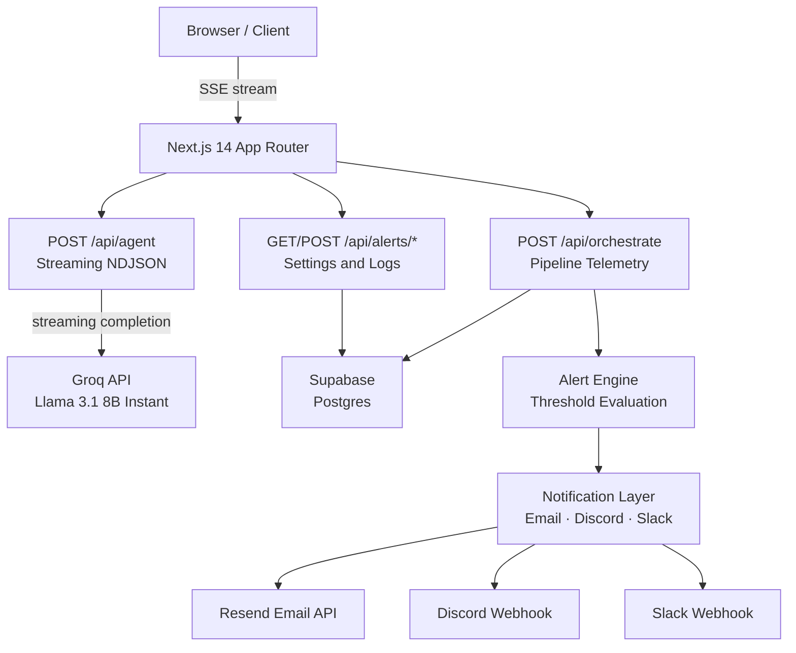
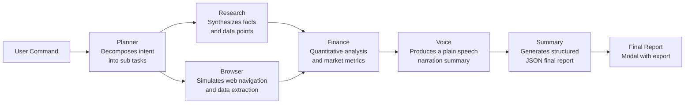
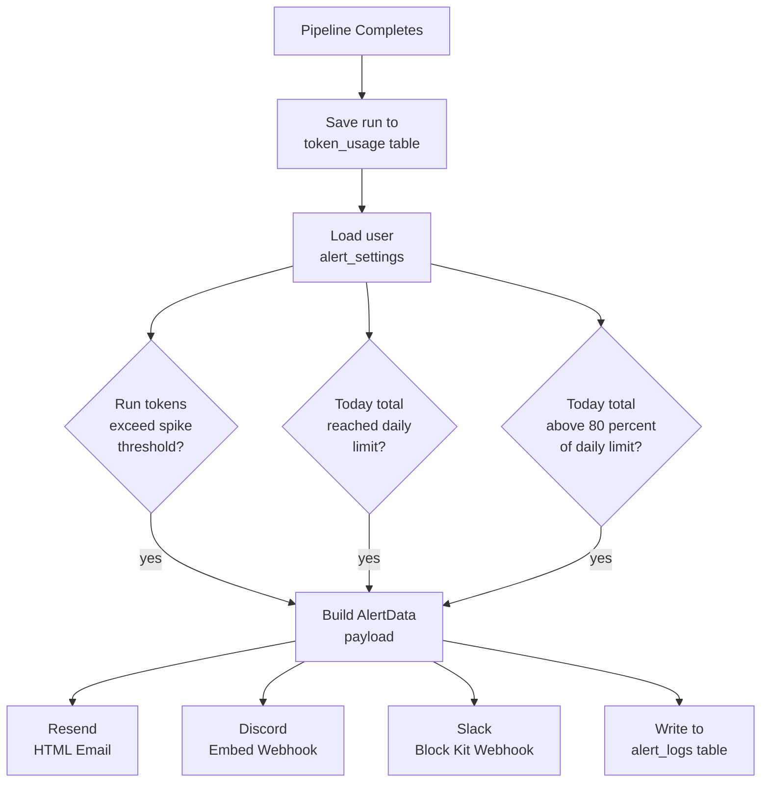
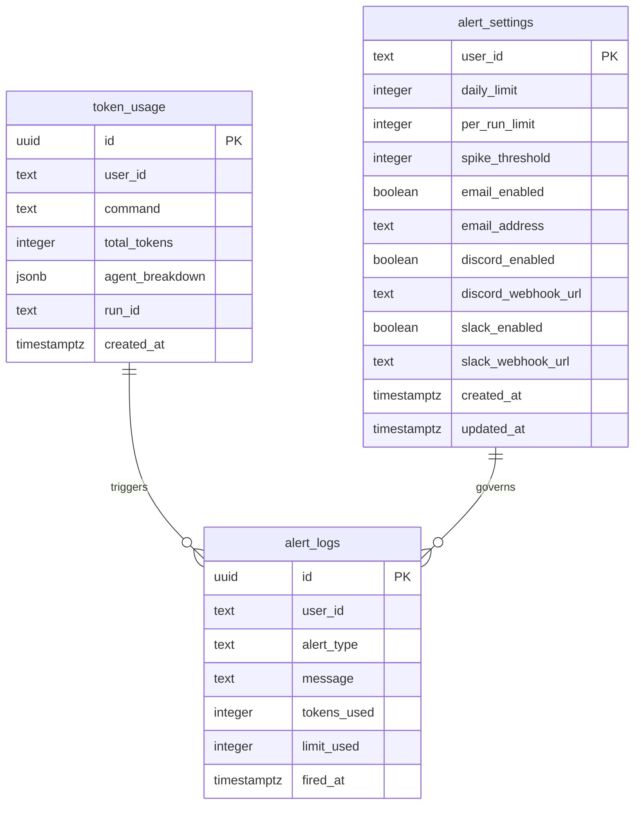

# Neural OPS

**AI Agent Orchestration Platform**

Neural OPS is a production grade command center for running multi agent AI pipelines. Submit a natural language command and watch a coordinated fleet of specialized agents plan, research, browse, analyze, narrate, and summarize in real time — with live streaming output, an animated workflow graph, token telemetry, and configurable alerting.

---

## Table of Contents

1. [Overview](#overview)
2. [Architecture](#architecture)
3. [Agent Pipeline](#agent-pipeline)
4. [Alert System](#alert-system)
5. [Tech Stack](#tech-stack)
6. [Database Schema](#database-schema)
7. [Getting Started](#getting-started)
8. [Environment Variables](#environment-variables)
9. [Keyboard Shortcuts](#keyboard-shortcuts)
10. [Project Structure](#project-structure)
11. [Deployment](#deployment)

---

## Overview

Neural OPS exposes a single command interface. The user types a query — e.g. *"Research NVIDIA stock and summarize the latest AI news"* — and six agents execute in a directed pipeline. Each agent streams its output token by token. When the pipeline finishes, a structured final report is generated and optionally narrated aloud via the Web Speech API.

The platform also persists every run to Supabase, tracks daily token consumption, and fires alerts to Email, Discord, or Slack when configurable thresholds are crossed.

---

## Architecture



---

## Agent Pipeline

Six agents execute in a fixed topology. The Planner always runs first. Research and Browser execute in parallel. Finance, Voice, and Summary run sequentially after that.



Each agent receives the accumulated context from all previous agents as part of its prompt, allowing downstream agents to build on upstream findings.

**Agent responsibilities:**

| Agent | Role | Model Input |
|---|---|---|
| Planner | Decomposes the user query into 3 to 4 numbered steps | Query only |
| Research | Synthesizes factual information and key data points | Query plus planner output |
| Browser | Simulates URL navigation and data extraction | Query plus prior context |
| Finance | Provides quantitative analysis and market metrics | Full context so far |
| Voice | Writes a concise plain text narration (no markdown) | Full context so far |
| Summary | Produces a JSON object: title, keyFindings, recommendation, confidence | Full context |

**Failure handling:** every agent retries once on error. If the retry also fails the agent is marked as failed, a fallback message is stored, and the pipeline continues. The Browser agent supports a simulated failure mode for demonstration purposes.

---

## Alert System

After every pipeline run, token usage is persisted and the alert engine evaluates three independent conditions against the user's configured thresholds.



Alert types:

| Type | Condition | Severity |
|---|---|---|
| Spike | Single run token count exceeds `spike_threshold` | Informational |
| Warning | Daily total between 80% and 100% of `daily_limit` | Warning |
| Critical | Daily total meets or exceeds `daily_limit` | Critical |

All three notification channels are independently toggleable from the Alert Settings page at `/settings/alerts`.

---

## Tech Stack

| Layer | Technology |
|---|---|
| Framework | Next.js 14 App Router, TypeScript |
| AI Model | Groq API — Llama 3.1 8B Instant (streaming) |
| Styling | Tailwind CSS 3, custom design tokens |
| Animation | Framer Motion |
| Graph | ReactFlow with animated edges |
| Voice | Web Speech API |
| Auth | NextAuth v4 |
| Database | Supabase (Postgres) |
| Email | Resend |
| Notifications | Discord Webhooks, Slack Block Kit |
| Deployment | Vercel |

---

## Database Schema

Three tables are used. All are protected by Row Level Security.



To create all tables, run `supabase/schema.sql` in the Supabase SQL Editor.

---

## Getting Started

### 1. Clone and install

```bash
git clone https://github.com/pradhyum6144/Neural-OPS.git
cd Neural-OPS
npm install
```

### 2. Configure environment

```bash
cp .env.local.example .env.local
```

Edit `.env.local` with your credentials (see [Environment Variables](#environment-variables) below).

### 3. Create Supabase tables

Open your Supabase project, go to **SQL Editor**, paste the contents of `supabase/schema.sql`, and run it.

### 4. Run the development server

```bash
npm run dev
```

Open [http://localhost:3000/dashboard](http://localhost:3000/dashboard).

---

## Environment Variables

| Variable | Required | Description |
|---|---|---|
| `GROQ_API_KEY` | Yes | Groq API key for agent completions |
| `NEXTAUTH_URL` | Yes | Full URL of your deployment e.g. `http://localhost:3000` |
| `NEXTAUTH_SECRET` | Yes | Random secret for NextAuth session encryption |
| `NEXT_PUBLIC_SUPABASE_URL` | Optional | Supabase project URL — enables token persistence |
| `SUPABASE_SERVICE_ROLE_KEY` | Optional | Supabase service role key (bypasses RLS) |
| `RESEND_API_KEY` | Optional | Resend API key — enables email alerts |

Supabase and Resend are optional. If `NEXT_PUBLIC_SUPABASE_URL` or `SUPABASE_SERVICE_ROLE_KEY` are absent, the orchestrate endpoint silently skips persistence and no alerts are fired.

---

## Keyboard Shortcuts

| Shortcut | Action |
|---|---|
| `Ctrl K` | Focus the command input |
| `Ctrl Enter` | Execute the pipeline |
| `Escape` | Stop a running pipeline or close the report modal |
| `Ctrl E` | Export the final report as a Markdown file |

---

## Project Structure

```
app/
  page.tsx                        Landing page
  dashboard/page.tsx              Command center
  login/page.tsx                  Sign in
  signup/page.tsx                 Sign up
  settings/alerts/page.tsx        Alert configuration
  api/
    agent/route.ts                Streaming agent completions via Groq
    orchestrate/route.ts          Pipeline telemetry — save tokens, fire alerts
    alerts/
      settings/route.ts           Read and write alert settings
      usage/route.ts              Query daily token totals
      logs/route.ts               Read fired alert history
      test/route.ts               Send a test alert

components/
  dashboard/
    agent-fleet.tsx               Agent status cards with streaming output
    browser-replay.tsx            Simulated browser chrome
    command-input.tsx             Terminal input with suggestion chips
    final-report.tsx              Structured result modal with export
    infra-heatmap.tsx             Metrics grid with animated progress bars
    live-log.tsx                  Real time pipeline log with copy and clear
    memory-nodes.tsx              In memory KV store visualizer
    sidebar.tsx                   Navigation and run history panel
    topbar.tsx                    Status bar with pipeline progress
    waveform.tsx                  Animated audio waveform bars
    workflow-graph.tsx            ReactFlow pipeline graph
  landing/
    hero.tsx                      Hero section
    navbar.tsx                    Top navigation
    features.tsx                  Feature highlights
    pricing.tsx                   Pricing tiers
    footer.tsx                    Footer
    social-proof.tsx              Social proof section
  auth/
    floating-orbs.tsx             Background animation for auth pages
    google-button.tsx             Google sign in button
    input-field.tsx               Styled auth input

hooks/
  use-dashboard.ts                Central state machine using useReducer
  use-speech.ts                   Web Speech API wrapper
  use-workflow-history.ts         Run history persisted to localStorage
  use-local-storage.ts            Generic localStorage hook
  use-agent-stream.ts             Agent streaming helper

lib/
  supabase.ts                     Supabase client singleton
  tokenTracker.ts                 Save runs and query daily usage
  alertEngine.ts                  Threshold evaluation and alert dispatch
  notifications.ts                Email, Discord, and Slack notification senders
  auth.ts                         NextAuth configuration
  constants.ts                    Shared type constants
  utils.ts                        Utility functions

supabase/
  schema.sql                      Postgres DDL for all tables
```

---

## Deployment

### Deploy to Vercel

```bash
npm i -g vercel
vercel env add GROQ_API_KEY
vercel env add NEXTAUTH_URL
vercel env add NEXTAUTH_SECRET
vercel env add NEXT_PUBLIC_SUPABASE_URL
vercel env add SUPABASE_SERVICE_ROLE_KEY
vercel env add RESEND_API_KEY
vercel deploy --prod
```

The repository includes a `vercel.json` with optimal configuration for Next.js streaming responses.

### One click deploy

[](https://vercel.com/new/clone?repository-url=https://github.com/pradhyum6144/Neural-OPS)

---

## License

MIT
